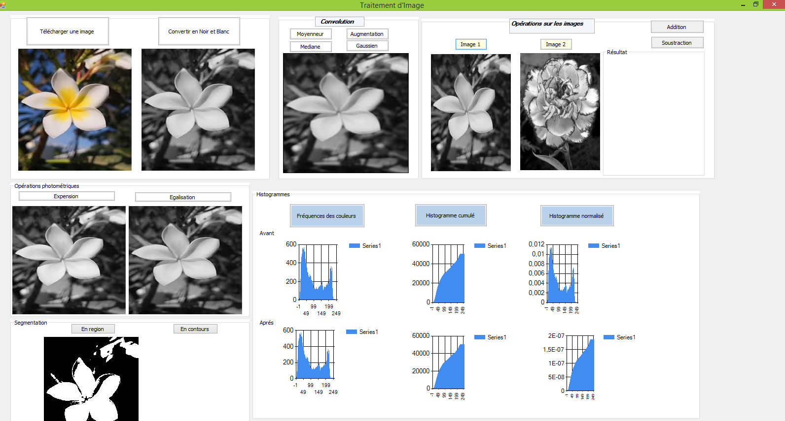

# Image Processing
Une application permettant d'appliquer les opérations de base pour le traitement et l'analyse des images.

##

## Technologies
* C#
* Visual Studio
## Fonctionnalités
* Convertir un image en noir et blanc
* Expansion
* Egalisation
* Segmentation
  * en région
  * en contour
* Convolution
  * Moyenneur
  * Augmentation
  * Mediane
  * Gaussien
* Calculer la fréquence des couleurs
* Claluler l’histogramme cumulé
* Calculer l’histogramme normalisé
* Addition de deux images
* Soustraction de deux images

## Setup
 
